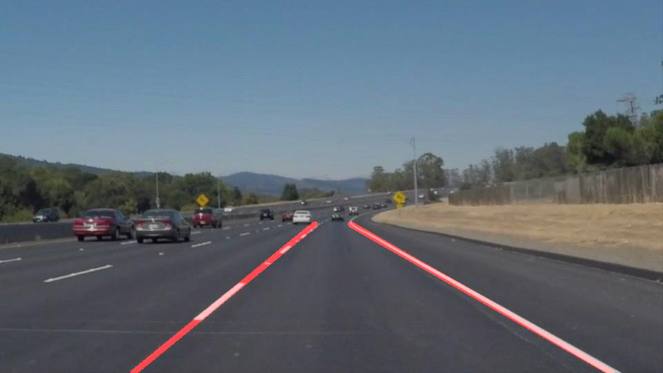
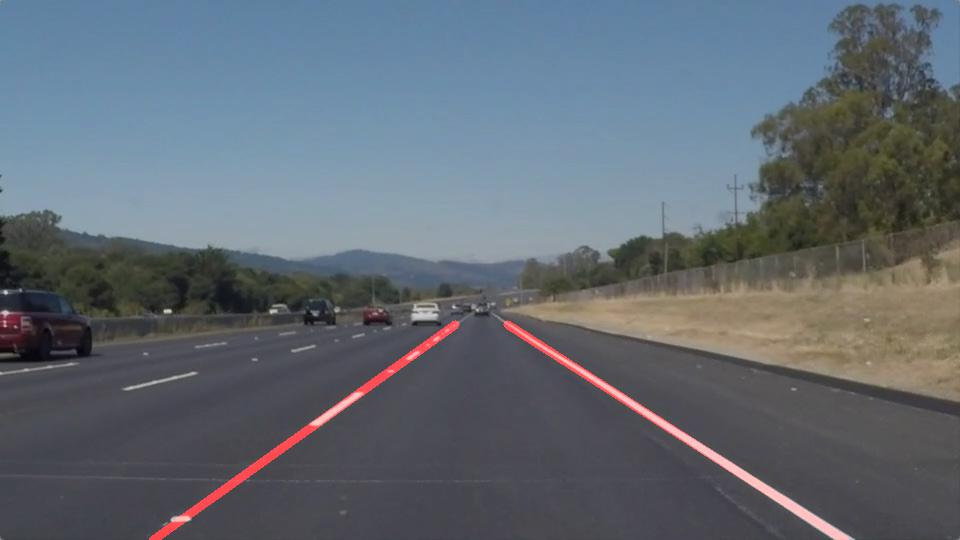
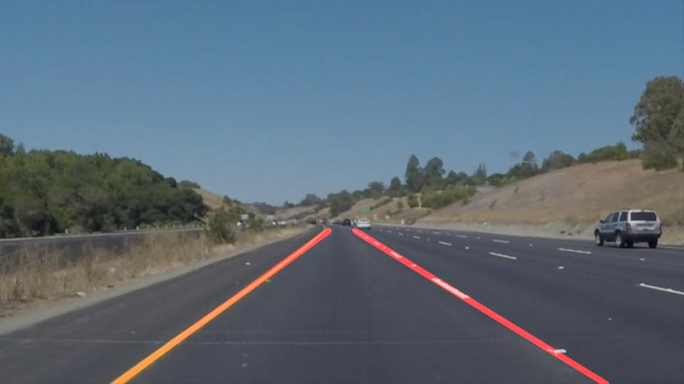
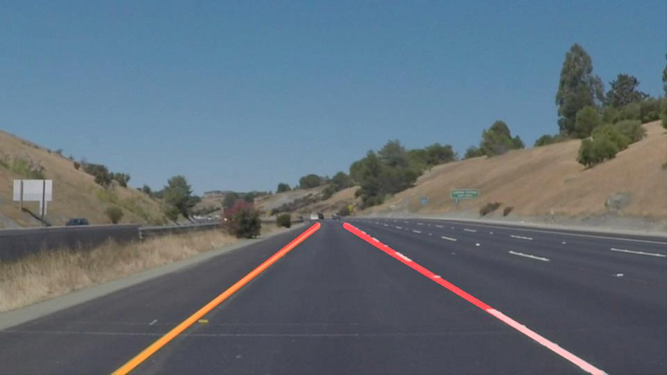
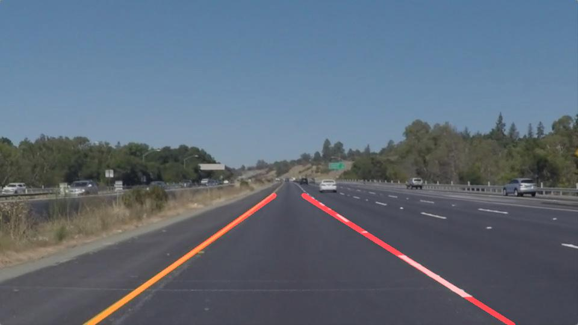
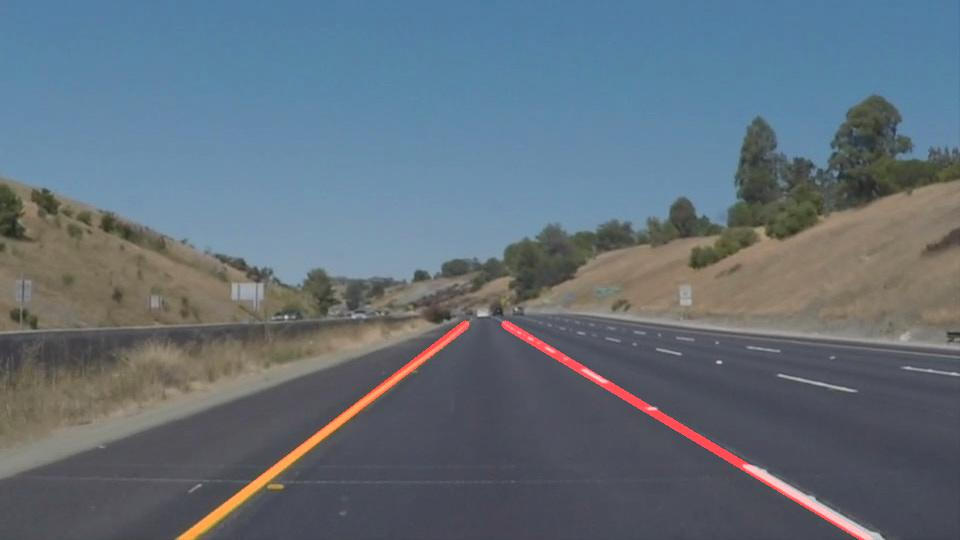

# **Finding Lane Lines on the Road**

## [Project description](ProjectDescription.md)

## Project summary

### Pipeline description

The pipeline consists of the following steps:

1. Color Selection

  Test images are loaded in RGB color space. In order to detect different colors of lane lines more reliably than in RGB color space, HLS color space is used. White and yellow lane lines are filtered separately and combined to singular mask which is applied to test images.

2. Gaussian Smoothing / Blurring

  Images are converted to grayscale after which Gaussian smoothing is applied to suppress noise and get smoother edges.

3. Canny Edge Detection

  Canny Edge Detection is used to detect individual edge pixels that follow the strongest gradients.

4. Region Masking

  4 points were selected by opening images in interactive window which helped in coordination selection. Those 4 points are used to define polygon which represents region of interest in which pixels for lines are considered.

5. Hough Transform

  Line segments are isolated by using Hough Transform.

6. Line Extrapolation

  There are multiple line segments for each line. Line extrapolation is used to draw a single line for right and left lane segments. Left lane segments have positive slope and right lane segments have negative slope. After separating line segments, average slope and intercept are calculated for each lane which are then used to draw single right and left line.

Images from each step can be found in [test_images_output](test_images_output/) folder.
 
Comparison between original test images and resulting images is shown in the table below.

  | test images| resulting images|
  |:---------------------------------------:|:----------------------------------------------:|
  |     |     |
  |     |     |
  |    |    |
  |   |   |
  |     |     |
  |  |  |

Resulting video outputs can be found in [test_videos_output](test_videos_output/) folder.

### Potential shortcomings

This pipeline wouldn't perform well in curved lanes. Resulting lanes are generated by calculating first degree polynomial and in case of wide turns on the road, line extrapolation would not hold.

Another potential shortcoming is that it wouldn't perform well for steep roads because in that case, region of interest (which in this case is selected with specific 4 points) may be different.

This pipeline also doesn't take previously detected lines into account. This is an issue for videos which have frames where it's more difficult to detect lanes (e.g. change in brightness, obstacles on the road, ...). In those cases it wouldn't be possible to constantly detect lines on the road.

### Possible improvements

A possible improvement would be to use advanced lane finding methods to handle curved lines, region of interest and other edge cases to make it more robust to different driving / road scenarios.
