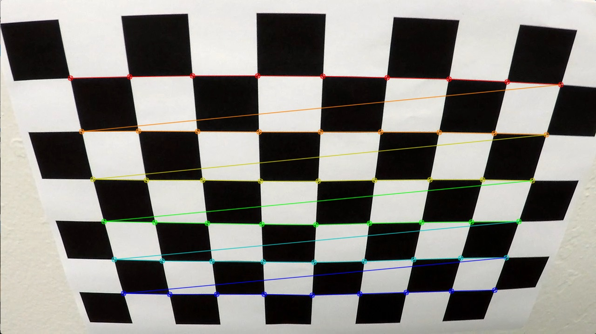
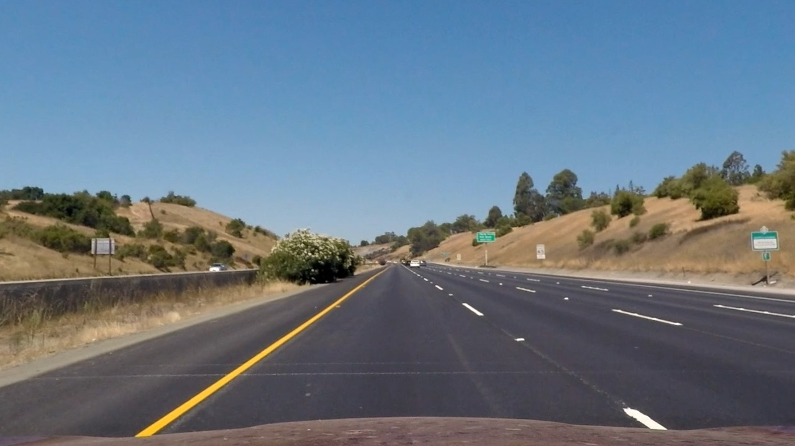
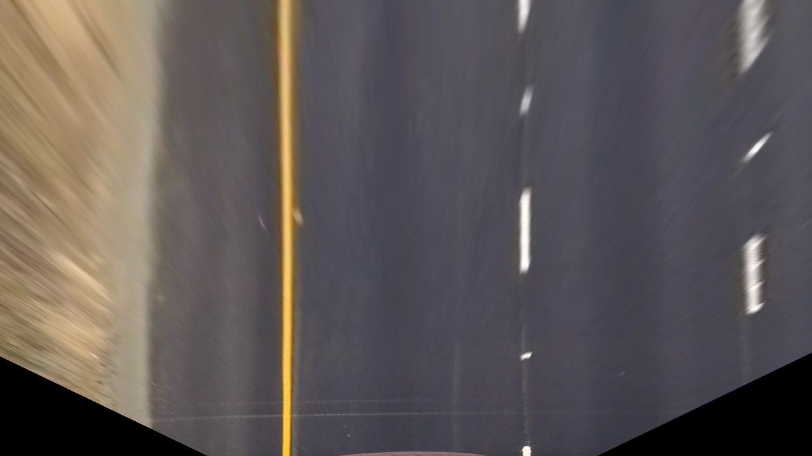
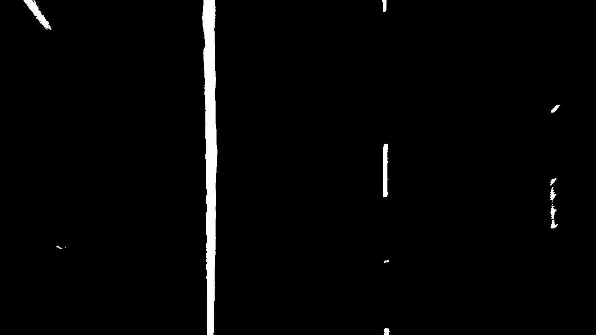
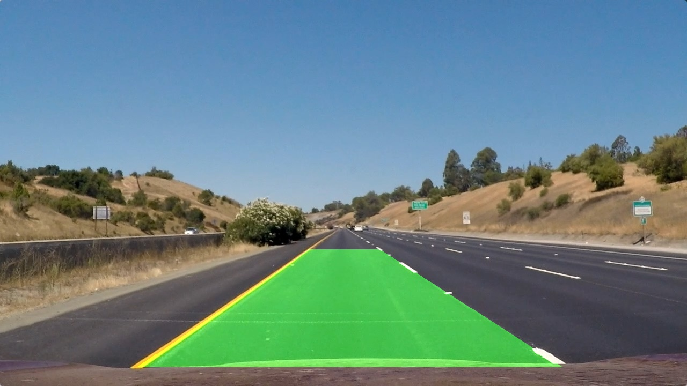

# **Advanced Lane Finding**

## [Project description](ProjectDescription.md)

## Project summary

The goals / steps of this project are the following:

* Compute the camera calibration matrix and distortion coefficients given a set of chessboard images.
* Apply a distortion correction to raw images.
* Use color transforms, gradients, etc., to create a thresholded binary image.
* Apply a perspective transform to rectify binary image ("birds-eye view").
* Detect lane pixels and fit to find the lane boundary.
* Determine the curvature of the lane and vehicle position with respect to center.
* Warp the detected lane boundaries back onto the original image.
* Output visual display of the lane boundaries and numerical estimation of lane curvature and vehicle position.

#### Project source code is available in [P2.ipynb](P2.ipynb)

---

### Camera Calibration

To calibrate camera, OpenCV functions `findChessboardCorners` and `calibrateCamera` are used. Camera calibration was calculated using images in [camera_cal](camera_cal/) folder. Calculated camera matrix and distortion coefficients are saved in [calibrate_camera_data.pickle](output_data/calibrate_camera_data.pickle).

Comparison between original image and detected chessboard corners is shown below.

| original image | detected chessboard corners|
|:---------------------------------------:|:----------------------------------------------:|
|     |   |

### Pipeline description

The pipeline consists of the following steps:

1. Undistort image

  Undistort image using  `cv2.undistort` with calculated camera calibration parameters.

  Comparison between original test image and resulting image is shown in below.

  | original image | undistorted image|
  |:---------------------------------------:|:----------------------------------------------:|
  |     |     |

2. Perspective Transformation

  Apply perspective transformation to image using `perspective_transform` function which takes hardcoded source and destination values.

  Comparison between undistorted image and transformed perception image is shown below.

  | undistorted image | transformed perception |
  |:---------------------------------------:|:----------------------------------------------:|
  |     |  |

3. Color Spaces and Thresholding

  Apply color thresholding to isolate lane lines. The L channel of the HLS color space is used  to isolate white lines and the B channel of the LAB colorspace is used to to isolate yellow lines. These two combined give solid results so no additional gradient thresholds are used in the pipeline.

  Comparison between colored undistorted image and transformed perception image with applied color threshold is shown below.

  | transformed perception | transformed perception with threshold |
  |:---------------------------------------:|:----------------------------------------------:|
  |     |  |

4. Detect Lane lines

  If one or both lane lines were not detected from last frame, `sliding_window_polyfit` function is used which applies Sliding Window algorithm. Otherwise, to avoid running computation for each frame, `search_around_poly` is used which searches lane lines in a margin around the previously detected lane line position. As a result, second order polynomial to both right and left lane lines is fitted to the image.

5. Calculate Lane Curvature

  Calculate radius of a lane curvature at any given point x.

6. Calculate Distance From Lane center

  Calculate car's position between left and right lane lines.

7. Draw Lane and Data

  Draw detected lane area and calculated lane curvature and distance from lane center.

8. Line Class

  To keep track of detections from frame to frame, store information in `Line` class objects.

Comparison between original test image and resulting image is shown below.

  | test images | resulting image|
  |:---------------------------------------:|:----------------------------------------------:|
  |     |     |

#### Resulting video outputs can be found in [output_videos](output_videos/) folder.

### Discussion

This pipeline performs better than the pipeline from the first project, but still has its flaws. A good lane finding algorithm must be robust to changing light and weather conditions, types and curvatures of the road, etc. The pipeline described above works well on the project video but it still depends on hard coded parameters. The flaws are best visible in challenge video where there are cracks in lane detection process. Next step to improve would be to apply deep learning methods to make lane detection pipeline more robust.
