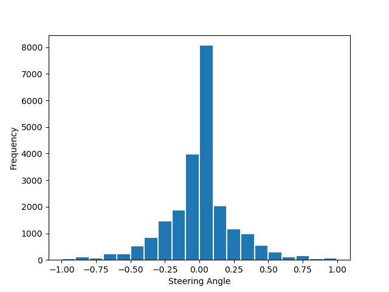
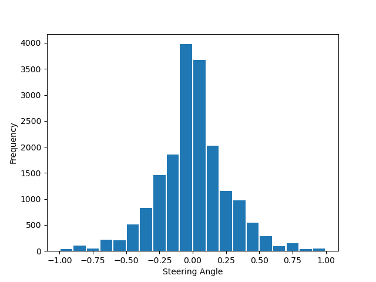
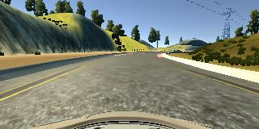
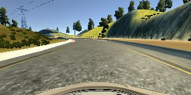
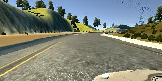
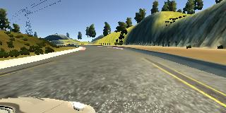
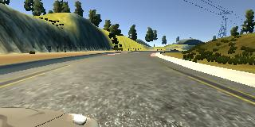
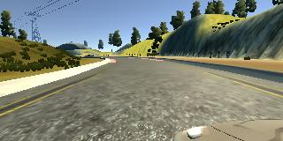
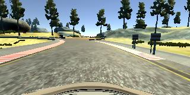
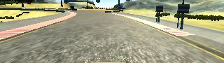

# **Behavioral Cloning**

## [Project description](ProjectDescription.md)

---

**Behavioral Cloning Project**

The goals / steps of this project are the following:
* Use the simulator to collect data of good driving behavior
* Build a convolution neural network in Keras that predicts steering angles from images
* Train and validate the model with a training and validation set
* Test that the model successfully drives around track one without leaving the road
* Summarize the results with a written report

## Rubric Points

---
### Files Submitted & Code Quality

#### 1. Submission includes all required files and can be used to run the simulator in autonomous mode

My project includes the following files:
* `model.py` containing the script to create and train the model
* `data_utils.py` containing functions for data loading and generation (preprocessing and batching)
* `drive.py` for driving the car in autonomous mode
* `model.h5` containing a trained convolution neural network
* `video.py` which can be used to create the video recording when in autonomous mode


* `solution_video.mp4` video recording of the car driving autonomously one lap around the track

#### 2. Submission includes functional code
Using the Udacity provided [simulator](https://github.com/udacity/self-driving-car-sim#term-1) and `drive.py` file, the car can be driven autonomously around the track by executing
```sh
python3 drive.py model.h5
```

#### 3. Submission code is usable and readable
The `model.py` file contains the code for training and saving the convolution neural network. The file shows the pipeline I used for training and validating the model, and it contains comments to explain how the code works.

### Model Architecture and Training Strategy

#### 1. An appropriate model architecture has been employed

Model architecture is based on [End-to-End Deep Learning for Self-Driving Cars](https://developer.nvidia.com/blog/deep-learning-self-driving-cars/) by NVIDIA. It is a convolutional neural network which maps the raw pixels from a front-facing cameras to the steering commands for a self-driving car.

In addition to NVIDIA architecture, I added two layers at the beginning:
  * `Cropping2D` layer removes top (sky and track background) and bottom (car hood) sections of each image which and are not relevant for steering information.
  * `Lambda` layer which divides each element by 255 and mean centers it by subtracting 0.5.

I also added one `Dropout` layer after convolutional layers to avoid overfitting.

The model contains ELU activation layers to introduce nonlinearity.

Complete model architecture (Keras summary):

| Layer (type)              |  Output Shape       | Param # |
|:-------------------------:|:-------------------:|:-------:|
| cropping2d_1 (Cropping2D) | (None, 90, 320, 3)  | 0       |
| lambda_1 (Lambda)         | (None, 90, 320, 3)  | 0       |
| conv2d_1 (Conv2D)         | (None, 43, 158, 24) | 1824    |
| conv2d_2 (Conv2D)         | (None, 20, 77, 36)  | 21636   |
| conv2d_3 (Conv2D)         | (None, 8, 37, 48)   | 43248   |
| conv2d_4 (Conv2D)         | (None, 6, 35, 64)   | 27712   |
| conv2d_5 (Conv2D)         | (None, 4, 33, 64)   | 36928   |
| dropout_1 (Dropout)       | (None, 4, 33, 64)   | 0       |
| flatten_1 (Flatten)       | (None, 8448)        | 0       |
| dense_1 (Dense)           | (None, 100)         | 844900  |
| dense_2 (Dense)           | (None, 50)          | 5050    |
| dense_3 (Dense)           | (None, 10)          | 510     |
| dense_4 (Dense)           | (None, 1)           | 11      |

Total params: 981,819<br>
Trainable params: 981,819<br>
Non-trainable params: 0

#### 2. Attempts to reduce overfitting in the model

I added one dropout layer with 50% keep probability after convolutional layers. I did try adding different dropout layers between fully connected layers, but that didn't do any significant difference on training and validation samples and it just made the car drive worse so I decided not to use those in the final model.

#### 3. Model parameter tuning

The model used an Adam optimizer with the mean squared error loss function, so the learning rate was not tuned manually.

#### 4. Appropriate training data

Training data was chosen to keep the vehicle driving on the road. I used a combination of center lane driving, recovering from the left and right sides of the road, driving in a counter-clockwise direction on both track 1 and track 2.

Before any augmentation, I remove majority of driving data samples with 0 degree steering angle because they are overrepresented due to simulator driving and tracks' design.

| steering angle data total distribution | steering angle data filtered distribution |
|:--------------------------------------------------:|:-----------------------------------------------------:|
|  |  |

For data augmentation, I used multiple cameras' images and flipped the images and steering measurements to compensate for left turn bias from track 1.

|        | original image | flipped image |
|:------:|:-------------------------------:|:---------------------------------------:|
| center |  |  |
| left   |    |    |
| right  |   |   |

I also cropped each image 50 rows pixels from the top and 20 rows pixels from the bottom to remove unnecessary information.

| original image | cropped image |
|:-------------------------------:|:---------------------------------------:|
|  |  |

The model uses images as the feature set and the steering measurements as the label set.

Data is shuffled and split where 80% is used for training and 20% for validation.

Used data is not attached in this repository.


See [Project_Info.ipynb](./Project_Info.ipynb) for project instructions and tips.
